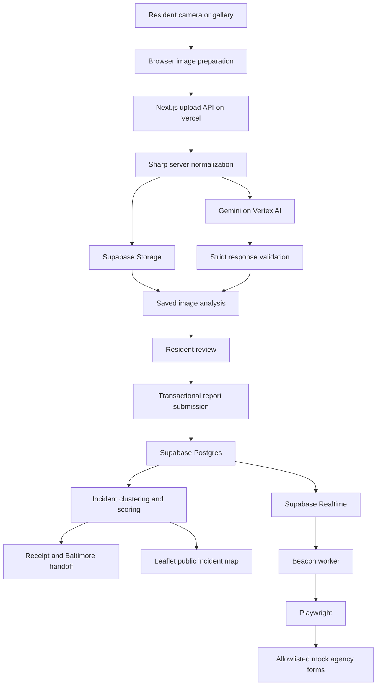

# One Minute Utopia

<p align="center">
  
</p>

<p align="center">
  <strong>Turn a photo into an actionable civic report in about one minute.</strong>
</p>

<p align="center">
  <a href="https://oneminuteutopia.vercel.app/"><strong>Launch the live app</strong></a>
</p>

One Minute Utopia is an AI-assisted civic reporting platform built for HopHacks
2026. It helps Baltimore residents turn a photo of a neighborhood problem into a
structured report, find the appropriate official reporting channel, and see when
nearby residents have documented the same incident.

The project focuses on the work between noticing a problem and filing a useful
report. Residents should not need to know which department owns a fallen tree,
flooded street, broken signal, illegal dump site, or damaged sidewalk before
they can take action.

## The problem

Existing 311 systems make civic reporting possible, but the resident may still
need to select an unfamiliar service category, write a description, provide a
location, and decide whether the issue belongs with 311, police, a utility, or
another agency. That friction can discourage reporting and produce incomplete or
misrouted requests.

Agencies also receive separate reports that may describe the same physical
incident. Without consistent categories and location-aware grouping, repeated
reports can become duplicate work instead of stronger community evidence.

One Minute Utopia addresses both sides of that gap:

- AI prepares a structured assessment from one photo.
- The resident reviews the result and remains in control of the report.
- A normalized incident taxonomy makes reports comparable.
- Location-aware clustering groups likely reports of the same incident.
- Baltimore-specific routing points the resident to the appropriate official
  destination.
- Beacon demonstrates how validated incidents could flow into future government
  reporting integrations.

The supporting research and its limitations are documented in
[docs/civic-reporting-research.md](docs/civic-reporting-research.md).

## What the app does

- Captures a photo from the camera or accepts an existing image.
- Compresses and re-encodes the image before analysis.
- Identifies a broad civic category and a normalized incident type.
- Produces a short factual description, seriousness score, confidence score, and
  allowlisted context tags.
- Adds time and location context with a manual location fallback.
- Lets the resident correct the category and add details before saving.
- Creates a durable report receipt backed by server-owned data.
- Routes the report to Baltimore 311, BPD, BGE, or emergency guidance as
  appropriate.
- Groups nearby reports that appear to describe the same incident into a
  super-report.
- Displays public incidents on an interactive map.
- Lets a browser session add or remove an independent “I see this too”
  confirmation.
- Sends score-ready incidents to Beacon for a safe mock form-filing
  demonstration.

No account is required for the current prototype.

## End-to-end workflow

### 1. Capture

The resident takes a photo or selects one from the device. Browser-side image
processing corrects orientation, limits the longest edge to 1,600 pixels,
converts the image to JPEG, removes embedded metadata through re-encoding, and
keeps the upload under 3 MB.

### 2. Validate and normalize

The Next.js upload route checks the request origin, content type, body size, and
session rate limit. Sharp decodes the image again on the server, verifies that it
is a real supported image, strips metadata, and produces a normalized JPEG. The
server never trusts the filename or browser MIME type alone.

### 3. Store and analyze

The normalized photo is written to Supabase Storage while the server sends the
image to Gemini 3.8 Flash through Google Cloud Vertex AI. The model returns a
constrained structured response containing:

- broad category;
- normalized incident type;
- seriousness from 0 to 10, or null when unavailable;
- AI confidence from 0 to 100;
- a short visual context summary;
- preset context tags.

The provider schema limits the response shape, and a stricter application
validator checks every field against the app's taxonomy before persistence.
Vertex rate limits receive bounded retries within one request deadline.

### 4. Persist the assessment

The server stores the analysis in `public.image_analyses` with the session,
image path, image hash, model, prompt version, and analysis status. The browser
receives an analysis ID, but it cannot replace the saved AI scores or invent a
trusted assessment.

If the AI provider is unavailable, the app records an explicit unavailable
state and allows the resident to complete a manual report. Missing analysis is
kept distinct from a zero-risk assessment.

### 5. Review

The resident sees the photo and a readable summary, confirms or changes the
category, supplies the issue location, and can add optional details. The
interface keeps internal scoring data out of the primary resident flow.

### 6. Save and cluster

Submission reloads the session-owned analysis from the database and creates the
report in a transaction. Repeating the same submission returns the existing
report instead of creating another.

Reports are compared using normalized incident type, time, and location. Two
reports can join the same incident when:

- they have the same normalized incident type;
- they were reported within a 72-hour window; and
- their GPS accuracy circles overlap.

Each accuracy circle uses twice the device-reported accuracy, clamped between 25
and 250 meters. Overlap is transitive, so a connected set of matching reports
can be consolidated into one incident. An incident with at least two independent
reports is displayed as a super-report.

### 7. Route and present

The receipt presents the appropriate next action:

- routine Baltimore issues link to the official BALT311 intake;
- eligible non-emergency police reports link to BPD's reporting portal;
- utility hazards link to BGE;
- immediate threats lead with 911 guidance;
- uncertain or unavailable classifications retain a manual reporting path.

The public map uses aggregate incident data rather than exposing browser session
identifiers. Residents can filter the map, inspect evidence, and contribute a
separate “I see this too” confirmation without creating another photo report.

### 8. Demonstrate future handoff with Beacon

Beacon is the project's autonomous reporting-agent prototype. It listens for new
report rows through Supabase Realtime, reloads the complete incident, recalculates
its readiness, selects a mock agency, and uses Playwright to complete the
corresponding form.

Beacon currently targets two allowlisted demonstration sites:

- a mock City 311 portal for general civic issues;
- a mock transportation portal for road, sidewalk, signal, and streetlight
  issues.

After a successful mock submission, Beacon stores the mock agency and reference
ID so the same incident is not filed again. It never automates the live Baltimore
portal.

## Incident scoring and Beacon readiness

Each completed AI assessment receives a server-side case score derived from
seriousness and confidence:

```text
case score = (seriousness / 10) × (0.5 + 0.5 × confidence)
```

Confidence is normalized to the range 0 to 1. Unavailable analyses receive no
positive score. When several independent sessions report the same incident,
their evidence combines as:

```text
incident score = 1 - ∏(1 - independent case score)
```

Only the strongest report from each anonymous session contributes, preventing
one browser session from inflating the score by repeatedly submitting the same
issue. An incident becomes ready for the Beacon demonstration at a score of
0.60, with coordinates and an open incident status. This allows one serious,
high-confidence hazard to cross the threshold while requiring more independent
evidence for lower-scoring conditions.

This is a hackathon decision model, not a calibrated public-safety standard.
Emergency guidance never waits for the Beacon threshold.

## Architecture



### Core data model

- **sessions:** anonymous first-party session ownership;
- **image_analyses:** server-owned AI output and image references;
- **reports:** confirmed resident submissions;
- **incidents:** grouped reports, aggregate context, and scoring state;
- **incident_confirmations:** reversible “I see this too” signals;
- **request_limits:** persistent upload and submission limits;
- **routing and mock filing fields:** Baltimore candidates, readiness,
  mock-agency state, and mock confirmation IDs.

Database migrations enable row-level security. Public browser roles do not read
the internal reporting tables directly; API routes perform server-side access
with validated inputs.

## Complete technology stack

| Layer | Technologies |
| --- | --- |
| Web application | Next.js 16 App Router, React 19, TypeScript 5 |
| Interface and styling | Tailwind CSS 4, responsive camera-first UI |
| Browser capabilities | MediaDevices camera access, Canvas image processing, Geolocation API, anonymous cookies |
| Server APIs | Next.js Route Handlers on the Node.js runtime |
| Hosting and deployment | Vercel production deployment and serverless functions |
| AI vision | Gemini 3.8 Flash through Google Cloud Vertex AI |
| AI contract | Vertex structured-output schema plus application-level validation |
| Image pipeline | Browser Canvas, Sharp, JPEG normalization, metadata stripping |
| Database | Supabase Postgres, SQL migrations, transactions, row-level security |
| Object storage | Supabase Storage |
| Events | Supabase Realtime |
| Database clients | `@supabase/supabase-js` and `postgres.js` |
| Mapping | Leaflet, React Leaflet, OpenStreetMap raster tiles |
| Automation | Beacon Node.js/TypeScript worker, `tsx`, Playwright, Chromium |
| Testing | Node test runner, PGlite embedded Postgres, mocked external services |
| Code quality | TypeScript compiler, ESLint, Next.js production builds |
| Source and delivery | Git, GitHub branches and pull requests, Vercel deployment |

## Agentic development workflow

The team used an agentic engineering workflow to build and debug the project
during the hackathon:

- **Grok Bot and Cursor Agents** ran a coordinated four-role workflow for primary
  implementation, code review, quality assurance, and UI polish.
- Those roles delegated bounded tasks to additional agents, compared findings,
  and handed reviewed changes back for integration.
- **Codex** supported architecture review, backend algorithms, repository-wide
  debugging, tests, and focused implementation work.
- **Gemini** supported development research while Gemini on Vertex AI powers the
  app's production image analysis.
- The human team selected the product direction, reviewed the generated work,
  resolved integration decisions, configured cloud services, performed live
  testing, and controlled what reached the repository.

This workflow was especially useful for isolating failures across Vertex AI,
Supabase, Vercel, the browser camera flow, and Beacon while parallelizing review
and verification.

## Public API surface

| Route | Purpose |
| --- | --- |
| `POST /api/upload` | Validate, normalize, store, analyze, and persist a photo |
| `POST /api/submit` | Save the reviewed report and create or join an incident |
| `GET /api/reports/:id/prepare-311` | Build a session-owned Baltimore handoff packet |
| `GET /api/incidents` | Return filtered, map-safe aggregate incidents |
| `POST /api/incidents/:id/confirmation` | Add an “I see this too” confirmation |
| `DELETE /api/incidents/:id/confirmation` | Remove that session's confirmation |
| `GET /api/baltimore-311/services` | Expose the normalized Baltimore service catalog |
| `GET /api/health` | Check database schema and service configuration |

## Baltimore scope

The current prototype is designed around Baltimore's reporting ecosystem. Its
internal taxonomy maps observable issues to Baltimore 311 service candidates,
official department information, BPD reporting, BGE reporting, or emergency
guidance. The app prepares the resident for the correct next step and links to
official destinations.

One Minute Utopia does **not** claim to submit reports to Baltimore City. The
current BALT311 intake does not provide this prototype with a public write
integration suitable for automated filing. The resident reviews and completes
the official submission. Beacon demonstrates the future automation concept only
against mock government websites.

## Safety, privacy, and limitations

- Call 911 for an active fire, serious injury, violence, or another immediate
  threat. The app is not an emergency dispatch system.
- AI output is a preliminary assessment and may be wrong. The resident can
  correct the category before saving.
- The seriousness score and Beacon threshold are prototype heuristics rather
  than validated safety or agency policy.
- Grouping is based on category, time, and approximate GPS overlap. It can miss
  related reports or group reports incorrectly.
- The public map may expose a report photo, description, address, and precise
  coordinates. Demo submissions should use consented public-space images and
  avoid faces, license plates, home interiors, medical information, or other
  identifying content.
- Re-encoding strips embedded metadata but cannot remove identifying content
  visible inside the photo.
- A production deployment would require formal city partnerships, moderation,
  retention and deletion policies, accessibility and resident testing, tuned
  incident-grouping rules, and stronger identity and abuse controls.

## Repository guide

```text
app/                         Next.js pages and API routes
components/                  Analysis, instructions, and map UI
lib/gemini.ts                Vertex AI request, retry, and validation
lib/image-*.ts               Browser and server image processing
lib/incident-*.ts            Taxonomy, clustering, scoring, and map contracts
lib/baltimore-*.ts           Baltimore service catalog and routing
lib/db.ts                    Persistence, transactions, and incident grouping
worker/                      Beacon Realtime and Playwright worker
supabase/migrations/         Database schema and upgrades
tests/                       Unit, integration, persistence, and contract tests
docs/                        Research and detailed subsystem documentation
```

Detailed documentation:

- [Civic reporting research](docs/civic-reporting-research.md)
- [Image analysis pipeline](docs/image-analysis.md)
- [Incident intelligence and Beacon](docs/incident-intelligence.md)
- [Baltimore reporting catalog](docs/baltimore-reporting-catalog.md)
- [Public map architecture](docs/map.md)

## Built for HopHacks 2026

One Minute Utopia was created for the HopHacks philanthropy track as the team's
first hackathon project. It demonstrates a resident-facing reporting experience,
a full AI and data pipeline, community incident aggregation, Baltimore-specific
routing, and a forward-compatible path toward agency-integrated civic reporting.

**[Experience One Minute Utopia](https://oneminuteutopia.vercel.app/)**
